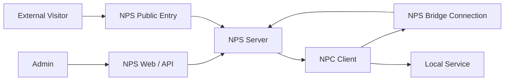

# 架构与核心概念

这页用于补概念，不是第一次部署必读。只想验证链路时先看 [10 分钟快速开始](/getting-started/quick-start.md)。

## 四个角色

| 角色 | 作用 | 常见位置 |
| --- | --- | --- |
| `NPS` | 服务端，接收公网访问并管理配置 | 公网服务器 |
| `NPC` | 客户端，把内网服务接入 NPS | 内网机器、边缘节点 |
| 管理员 | 管理客户端、隧道、域名转发和用户 | 浏览器、脚本、外部平台 |
| 访问者 | 最终访问服务的人或程序 | 浏览器、SSH、数据库客户端 |

## 两条链路

控制链路：

- NPC 使用 `tcp`、`tls`、`kcp`、`quic`、`ws`、`wss` 之一连接 NPS。
- 管理员通过 Web 或 API 管理资源。

数据链路：

- 访问者访问 NPS 公网入口。
- NPS 把流量转给 NPC 或本地目标。
- NPC 把流量转到内网服务。



## 容易混淆的概念

| 概念 | 说明 |
| --- | --- |
| 连接协议 | NPC 如何连接 NPS，例如 `tcp`、`tls`、`ws` |
| 隧道类型 | 你要暴露什么服务，例如 TCP、UDP、域名转发、P2P |
| 域名转发 | 按域名、协议、路径和证书路由，类似反向代理 |
| 端口隧道 | 按公网端口暴露 TCP、UDP、混合代理、私密代理等 |

例如：NPC 可以用 `-type=tls` 连接 NPS，同时创建 TCP 隧道和域名转发。

## 资源关系

```text
user -> client -> tunnel / host
```

| 资源 | 含义 |
| --- | --- |
| 用户 | 管理权限和资源归属 |
| 客户端 | 接入 NPS 的 NPC 实例 |
| 隧道 | 按端口暴露的转发规则 |
| 域名转发 | 按域名和路径暴露的转发规则 |

## 示例端口

| 端口 | 用途 |
| --- | --- |
| `8081` | Web 管理端 |
| `8024` | NPC TCP 连接 |
| `8025` | NPC TLS / QUIC 连接 |
| `8026` | NPC WS 连接 |
| `8027` | NPC WSS 连接 |
| `80` | HTTP 代理入口 |
| `443` | HTTPS 代理入口 |
| `6000` | P2P 协调入口 |

端口以实际 [服务端配置文件](/reference/server-config.md) 为准。

## 常见误解

- “客户端”是 NPC，不是最终访问者。
- “连接成功”不等于业务可访问，还需要创建转发规则。
- “TLS 连接 NPS”不等于业务一定是 HTTPS。
- P2P 不一定总能成功，网络环境会影响直连。
