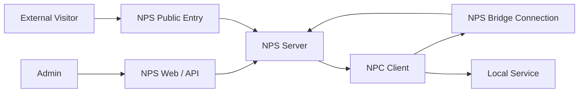

# 架构与核心概念

这页用于补概念，不是第一次部署时的必读页。

如果你现在只想先完成一条最小链路验证，可以先跳到 [10 分钟快速开始](/getting-started/quick-start)，后面再回来看这页。

如果你已经完成最小链路验证，再回来看这页，重点只要分清“谁在公网、谁在内网、谁是管理者、谁是真正访问的人”，后面很多术语就不会混淆。

## 先记住四个角色

| 角色 | 作用 | 常见部署位置 |
| --- | --- | --- |
| `NPS` | 服务端，负责接收公网访问、管理配置、维护客户端连接 | 公网服务器 |
| `NPC` | 客户端，负责把内网服务接入到 NPS | 内网机器、边缘节点、家用设备 |
| 管理员 | 通过 Web 管理界面或管理接口管理客户端、隧道、域名转发和用户 | 浏览器、自动化脚本、外部平台 |
| 访问者 | 最终访问被暴露服务的人或程序 | 浏览器、SSH、数据库客户端、游戏客户端 |

## 两条链路

### 控制链路

控制链路用于让 NPC 连到 NPS，并让管理端下发配置。

- NPC 通过 `tcp`、`tls`、`kcp`、`quic`、`ws`、`wss` 之一连接 NPS
- 管理员通过 Web 管理界面或管理接口管理资源

### 数据链路

数据链路用于承载真实业务流量。

- 访问者先访问 NPS 的公网入口
- NPS 再把流量转给对应的 NPC 或本地目标
- NPC 最终把流量转到内网服务



## 一定要分清的两件事

### 1. 连接协议不等于隧道类型

`tcp`、`tls`、`kcp`、`quic`、`ws`、`wss` 说的是 **NPC 如何连接 NPS**。

TCP 隧道、UDP 隧道、域名转发、Socks5、P2P 说的是 **你最终想暴露什么服务**。

举例：

- 你可以用 `-type=tls` 连接服务端
- 同时在这个客户端下面创建一个 TCP 隧道
- 也可以在同一个客户端下面再创建一个域名转发

### 2. 域名转发不属于“端口隧道”

NPS 里有两类公网入口：

- 按端口暴露：例如 TCP、UDP、HTTP 代理、Socks5、私密代理、P2P、文件访问
- 按域名和路径暴露：即域名转发

域名转发更像反向代理，按域名、协议、路径和证书路由流量。

## 资源关系

通常可以按下面的关系理解：

```text
user -> client -> tunnel / host
```

- 用户：管理权限和资源归属
- 客户端：一台接入 NPS 的 NPC 实例
- 隧道：按端口暴露的转发规则
- 域名转发：按域名和路径暴露的转发规则

## 默认常见端口

以下是仓库自带示例配置里最常见的端口：

| 端口 | 用途 |
| --- | --- |
| `8081` | Web 管理端 |
| `8024` | NPC 普通 TCP 连接 |
| `8025` | NPC TLS / QUIC 连接 |
| `8026` | NPC WS 连接 |
| `8027` | NPC WSS 连接 |
| `80` | HTTP 代理入口 |
| `443` | HTTPS 代理入口 |
| `6000` | P2P 协调入口 |

具体以 [服务端配置文件](/reference/server-config) 为准。

## 常见误解

- “客户端”不是最终访问者，而是接入 NPS 的 NPC。
- “连接成功”不等于“业务已经可访问”；还需要创建隧道或域名转发规则。
- “TLS 连接 NPS”不等于“你的业务一定是 HTTPS”；这两者是不同层级。
- “P2P”不一定总能成功，网络环境差或双方都是 Symmetric NAT 时通常无法直连。

## 下一步

1. 想先继续上手：看 [10 分钟快速开始](/getting-started/quick-start)
2. 想继续选型：看 [规则选型总览](/guide/design/tunnel-selection)
